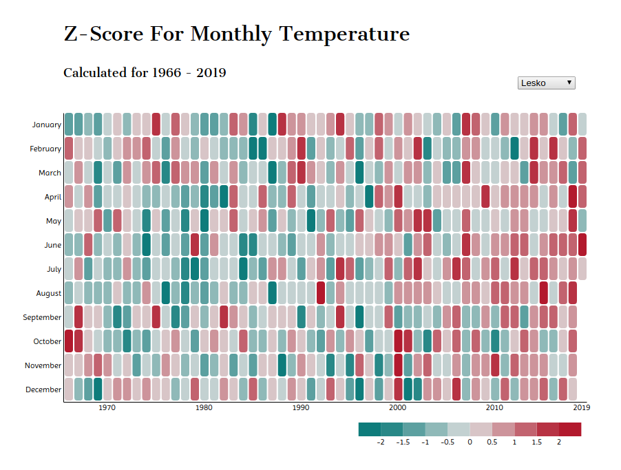

# Global-Warming-in-Poland---Heatmap
The D3 visualization shows temperature changes in selected polish cities over the last 50 years.

The data comes from [IMGW](https://dane.imgw.pl/data/dane_pomiarowo_obserwacyjne/dane_meteorologiczne/miesieczne/synop/) public dataset. Click [here](https://sylwia.hs3.linux.pl/my_files/temp_heatmap/frontend/index.html) to see the visualization in action. 

To gain the same reference for each month, the data is represented as **Z-score** (number of standard deviations from the mean). In this case mean was calculated separately for each month over the years. 

Ex. as shown below, the temperature in December 1971 was 1.1°C. The mean temperature for December (1966-2019) was -1°C. The temperature in observed month was 0.97 standard deviations from the December mean.

## Backend
The folder contains raw csv files manually downloaded from IMGW. The *preprocesing.py* file concatenates raw csv, create sepearted csv files for selected cities and save them in *frontend/preprocessed_csv* folder. Data for `(station_name == "WROCŁAW" and year <= 1965)` was excluded due to unreliable temperature (0°C every month).

## Frontend
The folder contains visualization code (html, css, JavaScript) and preprocessed files to be displayed.
